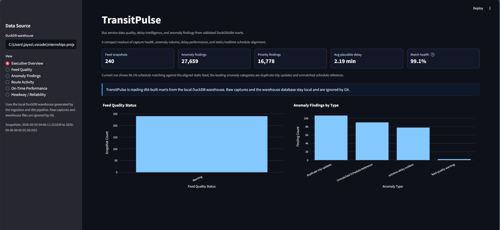
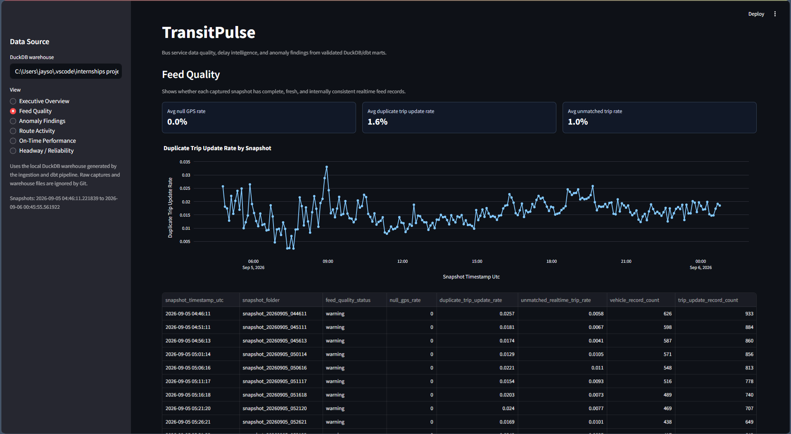
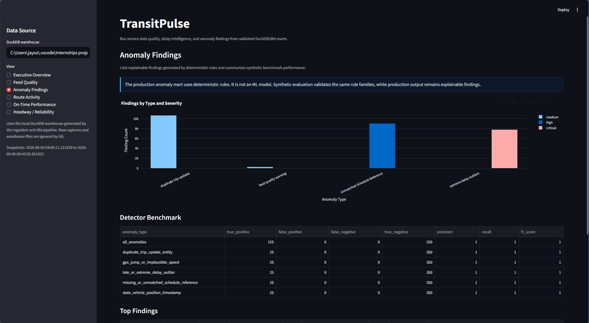
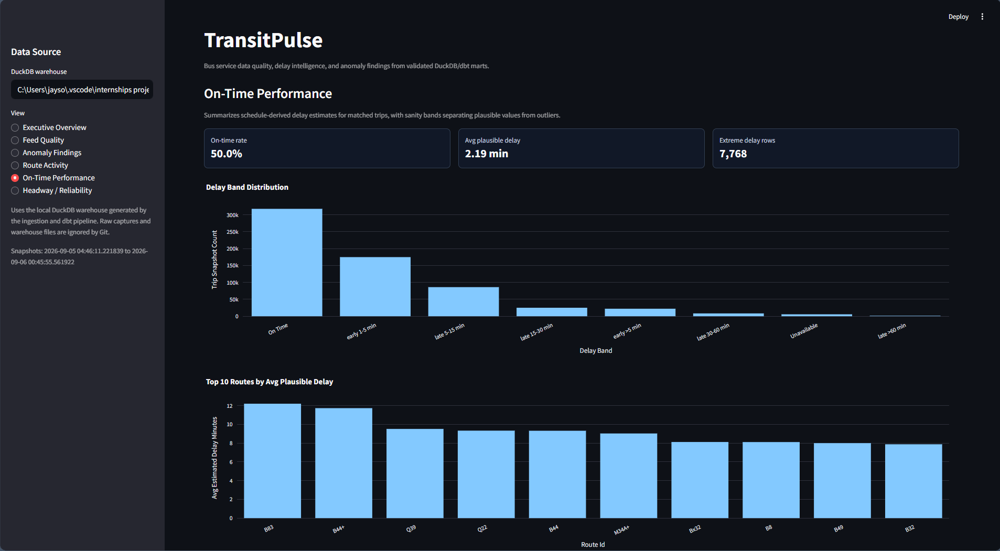
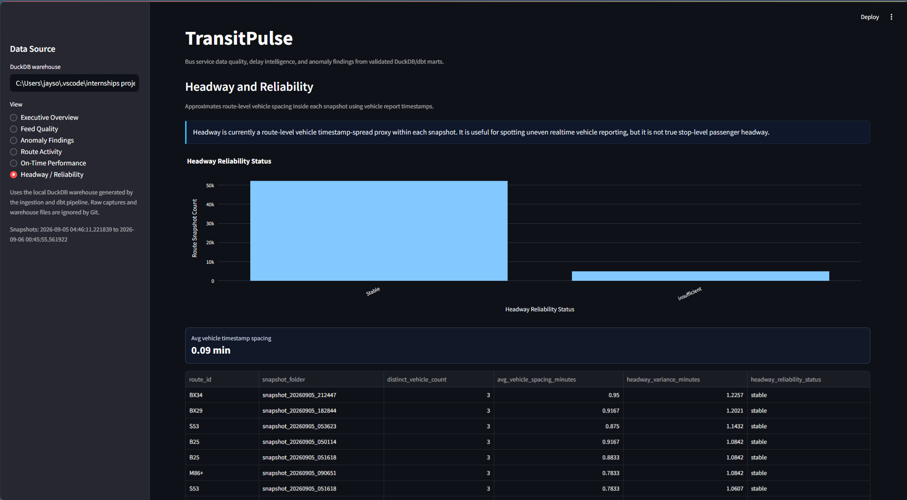

# TransitPulse

TransitPulse is a Bus Service Data Quality & Delay Intelligence Platform for NYC MTA bus data. It captures static GTFS schedules and GTFS-Realtime snapshots, loads them into DuckDB, models validated metrics with dbt, and presents feed quality, delay, route activity, headway proxy, and anomaly findings in a Streamlit dashboard.

The project is designed as a portfolio-grade analytics engineering build: reproducible local ingestion, documented warehouse layers, tested transformations, and a dashboard that clearly separates validated metrics from documented limitations.

## At A Glance

- 20-hour GTFS-Realtime capture used for the final dashboard refresh.
- 1M+ realtime records processed: 360,260 vehicle positions and 651,169 trip updates.
- 98.95% static/realtime schedule match after archived C6 feed alignment.
- 160 dbt tests passing across source, staging, intermediate, mart, and anomaly layers.

These figures describe the local validation dataset, not a long-term production deployment.

## Problem

Transit riders and transit operations teams rely on realtime bus data, but those feeds can contain stale vehicle positions, duplicate trip update entities, missing GPS coordinates, unmatched schedule references, and extreme delay outliers. TransitPulse turns raw GTFS and GTFS-RT files into queryable quality checks and stakeholder-facing metrics so feed reliability and service delay patterns are easier to inspect.

## Architecture

- Ingestion: Python scripts download MTA static GTFS feeds and capture GTFS-RT vehicle position/trip update snapshots.
- Storage: raw static and realtime files stay local under `data/raw/`; DuckDB stores raw, staged, intermediate, and mart tables.
- Transformation: dbt builds staging views, reusable intermediate models, tested quality checks, and final marts.
- Detection: deterministic rules score synthetic benchmark records and production anomaly findings.
- Dashboard: Streamlit and Plotly read the dbt marts from DuckDB for interactive review.
- Testing: pytest validates ingestion helpers; dbt tests validate source, staging, intermediate, mart, and anomaly logic.

```text
GTFS static feeds + GTFS-Realtime snapshots
                 |
                 v
Python ingestion scripts
                 |
                 v
DuckDB raw warehouse
                 |
                 v
dbt staging -> intermediate -> marts + tests
                 |
                 v
Streamlit dashboard
```

## Tech Stack

- Python
- requests
- pandas
- pyarrow
- gtfs-realtime-bindings
- DuckDB
- dbt-core
- dbt-duckdb
- Streamlit
- Plotly
- pytest

## Key Features

- Static GTFS downloader for all six MTA bus schedule feeds: MTA Bus Company, Brooklyn, Bronx, Manhattan, Queens, and Staten Island.
- One-shot and short-window GTFS-RT capture utilities for vehicle positions and trip updates.
- Raw DuckDB loader with multi-feed `source_feed` tagging.
- dbt staging, intermediate, and mart layers with 160 passing tests.
- Version-aligned static/realtime schedule matching using archived C6 MobilityDatabase GTFS feeds for the September 2 realtime capture.
- Feed quality, route activity, on-time performance, dimensions, headway proxy, and anomaly findings marts.
- Synthetic anomaly evaluation dataset with ground-truth labels.
- Explainable rule-based anomaly detector and production anomaly findings mart.
- Streamlit dashboard summarizing feed health, delay, and anomaly findings at a glance.

## Data Pipeline Flow

1. Download static GTFS schedule files.
2. Capture GTFS-RT vehicle positions and trip updates.
3. Load local raw files into `data/warehouse/transitpulse.duckdb`.
4. Run dbt to build staging, intermediate, quality, anomaly, and mart models.
5. Open the Streamlit dashboard against the validated DuckDB warehouse.

Raw captures and DuckDB database files are intentionally ignored by Git.

## dbt Model Layers

- Sources: raw DuckDB tables for static GTFS and GTFS-RT snapshots.
- Staging: typed and standardized route, trip, stop, stop time, vehicle position, and trip update models.
- Intermediate: schedule-vs-actual alignment, normalized realtime stop-time updates, stop-level delay calculations, feed quality checks, and anomaly evaluation logic.
- Marts:
  - `dim_route`: dimension-level, one row per `source_feed` + `route_id`.
  - `dim_stop`: dimension-level, one row per `source_feed` + `stop_id`.
  - `fct_feed_quality`: snapshot-level, one row per captured `snapshot_folder`.
  - `fct_route_realtime_activity`: route-snapshot-level, one row per `route_id` per `snapshot_folder`.
  - `fct_on_time_performance`: trip-observation-level, one row per `trip_id` per `snapshot_folder`.
  - `fct_headway`: route-snapshot-level proxy, one row per `route_id` per `snapshot_folder`.
  - `fct_anomaly_findings`: anomaly-finding-level, one row per detected anomaly or quality finding.

## Dashboard Overview

The Streamlit dashboard includes:

- Executive overview KPIs for snapshots, anomalies, high-priority findings, average plausible delay, and schedule match health.
- Feed quality trends by snapshot.
- Anomaly counts by type/severity, top findings, and synthetic detector benchmark results.
- Route realtime activity and top active routes.
- On-time performance delay bands and top delayed routes.
- Headway/reliability view labeled as an approximate vehicle timestamp-spread proxy.

## Dashboard Screenshots

Five dashboard screenshots are included below. A Route Activity screenshot can be added later if a separate route-focused portfolio view is needed.

### Executive Overview



### Feed Quality



### Anomaly Findings



### On-Time Performance



### Headway / Reliability



## Validation Results

Final dbt validation:

- `dbt run`: 26 models built
- `dbt test`: 160 tests passed

Final dashboard refresh capture:

- 240 realtime snapshots
- Capture window: 2026-09-05 04:46:11 UTC to 2026-09-06 00:45:55 UTC
- Duration: about 20 hours

Important: current metrics come from this 20-hour validation capture, not a full long-term production sample.

Validated row counts:

- `raw_vehicle_positions`: 360,260
- `raw_trip_updates`: 651,169
- `fct_feed_quality`: 240
- `fct_route_realtime_activity`: 57,369
- `fct_on_time_performance`: 640,225
- `fct_anomaly_findings`: 27,659

Schedule alignment:

- Schedule match health: 98.95%
- This reflects matching the 20-hour realtime capture against version-aligned archived C6 static GTFS feeds.
- A dbt regression guard fails if schedule match rate drops below 95%.

Operational metrics from the 20-hour validation capture:

- Average plausible estimated delay: about 2.19 minutes
- Production anomaly findings:
  - `duplicate_trip_update_entity`: 10,641
  - `unmatched_schedule_reference`: 9,010
  - `extreme_delay_outlier`: 7,768
  - `feed_quality_warning`: 240

The clean 20-hour refresh processed more than 1M realtime records across 240 snapshots and maintained a 98.95% trip-to-schedule match rate after archived feed alignment. The largest finding categories were duplicate trip update entities, unmatched schedule references, and extreme delay outliers. These counts identify records that need review; they do not by themselves prove a single operational root cause.

## Anomaly Detection

TransitPulse includes a synthetic anomaly evaluation dataset with 375 labeled records:

- 250 normal records
- 125 synthetic anomaly records
- 25 records each for:
  - stale vehicle position timestamp
  - GPS jump or implausible speed
  - duplicate trip update entity
  - missing or unmatched schedule reference
  - late or extreme delay outlier

The rule-based detector scored the synthetic benchmark as:

- True positives: 125
- False positives: 0
- False negatives: 0
- True negatives: 250
- Precision: 1.00
- Recall: 1.00
- F1: 1.00

This benchmark confirms the deterministic rules correctly catch the injected anomaly patterns. It does not prove generalization to all unseen or noisier real-world anomaly types, and the project does not claim ML-based anomaly detection.

## Important Caveats

- Current dashboard metrics are based on a 20-hour validation capture, not a full long-term production sample.
- The 98.95% schedule match depends on using archived C6 static GTFS feeds aligned to the realtime capture.
- Current public MTA static feeds had a later D6 rating and did not match the September 2 C6 realtime trip IDs.
- On-time performance uses schedule-derived delay estimates from realtime stop-time updates and static stop times.
- Headway is currently an approximate route-level vehicle timestamp-spread proxy, not true stop-level passenger headway.
- Anomaly detection is deterministic and rule-based, not ML.
- Raw data and the DuckDB warehouse are local-only and not committed.

## Run Locally

Create and activate a virtual environment on Windows:

```powershell
python -m venv .venv
.\.venv\Scripts\Activate.ps1
```

Install dependencies:

```powershell
python -m pip install -r requirements.txt
```

Run the environment test:

```powershell
python -m pytest tests/test_environment.py
```

Download all current MTA bus static feeds:

```powershell
python ingestion/download_static_gtfs.py --all-feeds
```

Capture one GTFS-RT snapshot:

```powershell
python ingestion/poll_gtfs_rt.py --vehicle-url "https://gtfsrt.prod.obanyc.com/vehiclePositions?key=YOUR_KEY" --trip-updates-url "https://gtfsrt.prod.obanyc.com/tripUpdates?key=YOUR_KEY"
```

Run a short capture window:

```powershell
python ingestion/run_realtime_capture.py --interval-minutes 5 --duration-minutes 60 --vehicle-url "https://gtfsrt.prod.obanyc.com/vehiclePositions?key=YOUR_KEY" --trip-updates-url "https://gtfsrt.prod.obanyc.com/tripUpdates?key=YOUR_KEY"
```

Load raw files into DuckDB:

```powershell
python ingestion/load_raw_to_duckdb.py
```

Reproducibility note: the next two commands reproduce the original author's C6-aligned 20-hour refresh. They require local gitignored archive and capture files under `data/raw/static_archives/c6_20260902` and `data/raw/realtime/`. Fresh clones should run their own capture and use the plain loader command unless those inputs are recreated locally.

For the September 2 C6 validation dataset, load the archived static feeds instead of the current D6 static feeds:

```powershell
python ingestion/load_raw_to_duckdb.py --static-dir data/raw/static_archives/c6_20260902
```

For the clean 20-hour dashboard refresh, filter the loader to the completed capture window:

```powershell
python ingestion/load_raw_to_duckdb.py --static-dir data/raw/static_archives/c6_20260902 --snapshot-start snapshot_20260905_044611 --snapshot-end snapshot_20260906_004555
```

Run dbt:

```powershell
dbt --project-dir dbt --profiles-dir dbt run
dbt --project-dir dbt --profiles-dir dbt test
```

Run the dashboard:

```powershell
streamlit run dashboard/app.py
```

## Repository Structure

```text
transitpulse/
|-- dashboard/              # Streamlit dashboard
|-- data/
|   `-- samples/            # Small committed samples only; raw/warehouse data is ignored
|-- dbt/                    # dbt project, models, tests, and profiles
|-- detection/              # Reserved for future detection utilities
|-- docs/                   # Investigation notes and project documentation
|-- ingestion/              # Static GTFS, GTFS-RT, and DuckDB loading scripts
|-- tests/                  # pytest tests for Python helpers
|-- requirements.txt
|-- pyproject.toml
`-- README.md
```

## Future Improvements

- Run a refreshed 12-hour or 24-hour GTFS-RT capture window for stronger dashboard evidence.
- Build true stop-level headway using stop arrivals/departures instead of the current vehicle timestamp-spread proxy.
- Improve service-date, timezone, and GTFS calendar precision for delay calculations around midnight and service-day boundaries.
- Add optional ML anomaly scoring after the rule-based baseline is stable and labeled evaluation data is richer.
